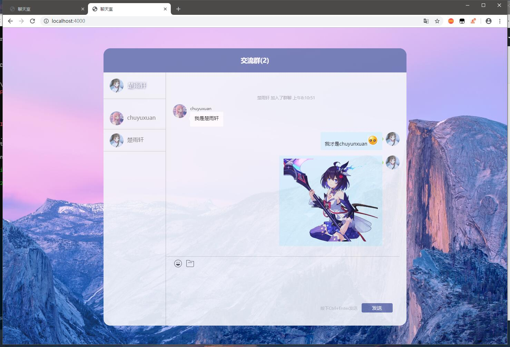
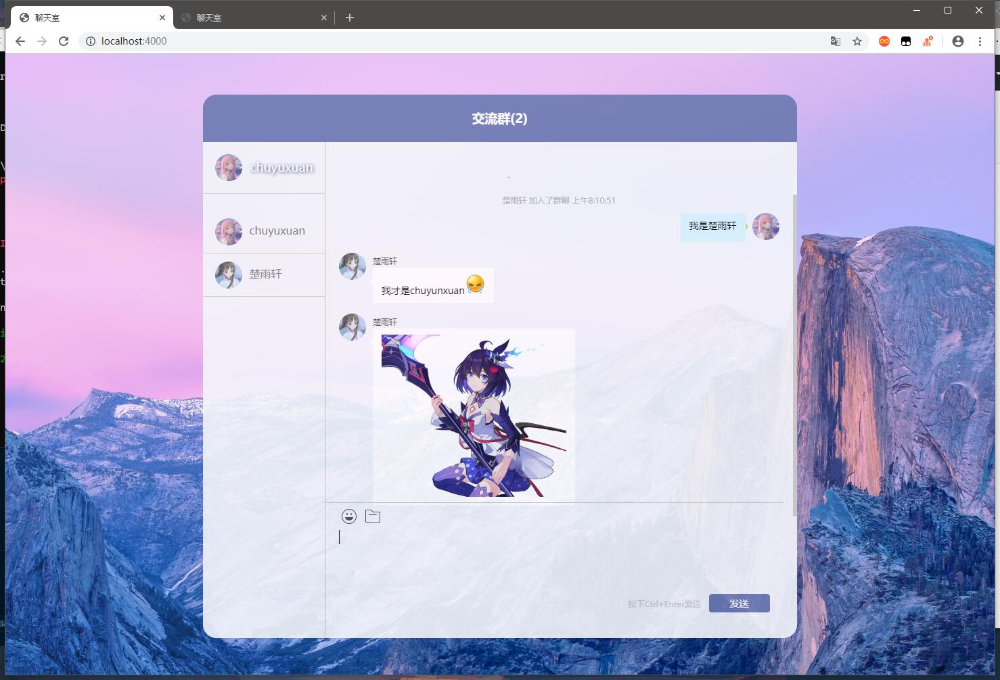
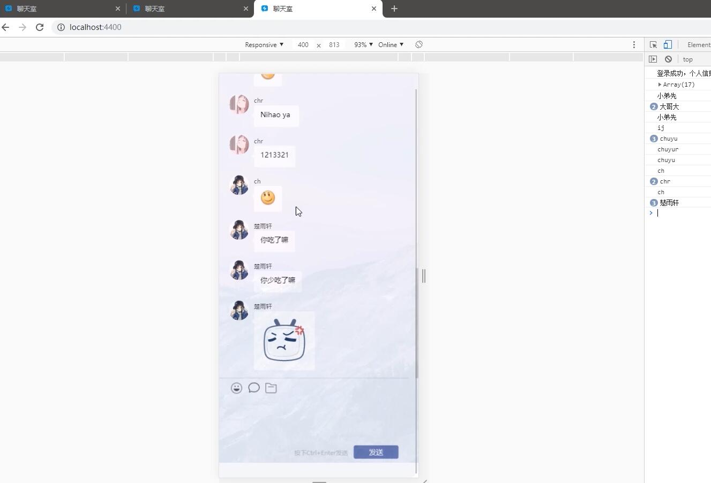

# webchat

一款基于`Javascript+express+socket.io`构成的网络在线聊天应用 

具体效果可以访问[http://chat.chuyuxuan.xyz:4400](http://chat.chuyuxuan.xyz:4400) 

+ **2020年10月10日前该链接有效，别问为啥，问就是服务器过期我负担不起😭，所以不错的话请给个star吧**


[](https://socket.io/)
[](https://www.mysql.com/downloads/)
[](https://github.com/aermin/ghChat/blob/master/LICENSE)
[](https://github.com/chuyuxuan0v0)


## 小项目讲解：[BV1B54y1D7dA](https://www.bilibili.com/video/BV1B54y1D7dA/)
## 小项目导入：[BV1v54y1B7LV](https://www.bilibili.com/video/BV1v54y1B7LV/)

---

# 下载

        git clone https://github.com/Chuyuxuan0v0/webchat.git

# 使用

+ 你需要安装`node.js`,接下来才能进行一下操作，否则会报错误。

⭐ 下载安装`node.js`
        
[点我下载](https://nodejs.org/en/download/)

        
⭐ 下载后进入根目录
        
        cd ...  \webchat\


⭐ 更新依赖

        npm install 
        
⭐ 在MySQL中导入相关表

        所有要建立的表我都放在express.sql里了，可以根据里面的sql语言自行建立，
        或者借用数据库管理工具例如 navicat 导入该文件进行表的创建。
**注意。我是依赖于mysql 8.0的版本而创建的表格，如果你的sql文件导入不成功，请手动创建表**
表格目录如下:

||||user_info||||
|:-|:-|:-|:-|:-|:-|:-|
|名|类型|长度|小数点|不是null|主键|注释|
|id|int|5|0|√|🔑|注册用户数，注意，要选择自增|
|name|varchar|15|0|√||用户名|
|avatar|varchar|100|0|√||头像路径|
|date|varchar|20|0|√||日期|

||||user_msg||||
|:-|:-|:-|:-|:-|:-|:-|
|名|类型|长度|小数点|不是null|主键|注释|
|id|int|5|0|√|🔑|注意，要选择自增|
|user|varchar|15|0|√||用户名|
|avatar|varchar|100|0|√||头像路径|
|msg|varchar|255|0|√||用户消息|
|date|varchar|20|0|√||日期|


*数据表会不定时更新，详情请看代码里的链接*

⭐ 更改数据库属性

        需要进入app.js 文件，大概在173行左右
        填入你的数据库配置相关


⭐ 启动项目

        node app.js

⭐ 在浏览器中输入以下网址 ~~这个端口可以自己更改的~~

        localhost:4400 


# 错误提示

如果你遇到以下错误请更新数据配置文件。
```sql        
错误演示：
throw err; // Rethrow non-MySQL errors

解决办法：
// 进入mysql 输入密码例如：123456
        mysql -u root -p 

// 1.执行语句 alter user 'root'@'localhost' identified with mysql_native_password by 密码;

mysql> alter user 'root'@'localhost' identified with mysql_native_password by '123456';


// 2.再执行语句 flush privileges;

mysql> flush privileges;

// 3.成功后 退出

mysql> quit
       
```


# 部分功能展示
+ 1.可以实现在线聊天，发送图片
+ 2.可以是使用`ctrl+Enter`发送消息
+ 3.进入退出有提示
+ 4.适应手机，有响应式布局
+ 5.查看历史聊天记录
+ 6.。。。。。

# 2020年6月2日更新
+ 修改了时间不显示的问题，增加了消息时间戳。
+ 增加了emoji表情发送，大家可以发送自己喜欢的emoji表情了。
+ 调整了响应速度。

# 待优化
- 优化UI界面，降低耦合性
- 优化界面响应速度
- 能够私聊个人，一对一聊天
- 。。。。。

# 部分预览




